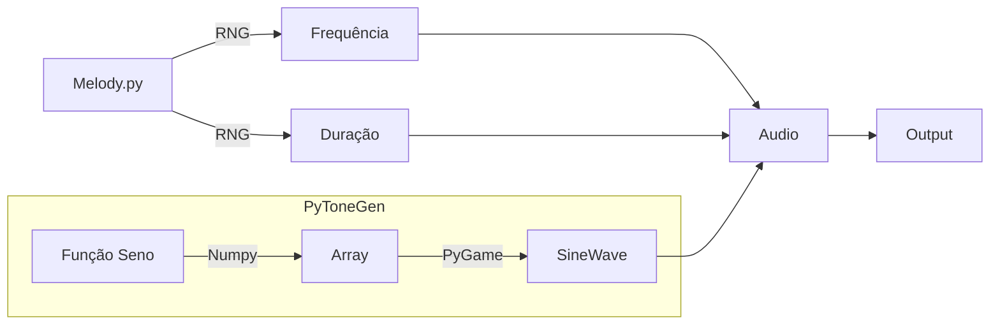

# PyToneGen

### Descrição

Gerador de sons em Python, utilizando-se de ondas senóides. Baseado em PyGame.

### Funcionamento

Segue diagrama de funcionamento do exemplo "Melody.py" disponibilizado)

### Dependências

- pygame
- time
- math
- numpy
- time (Para o exemplo "Melody.py")
